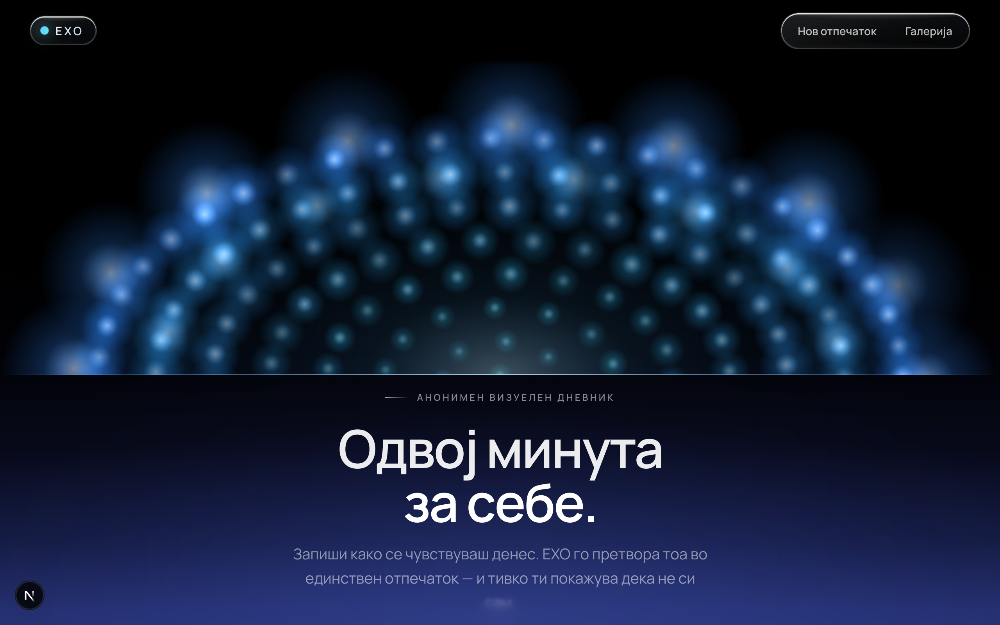
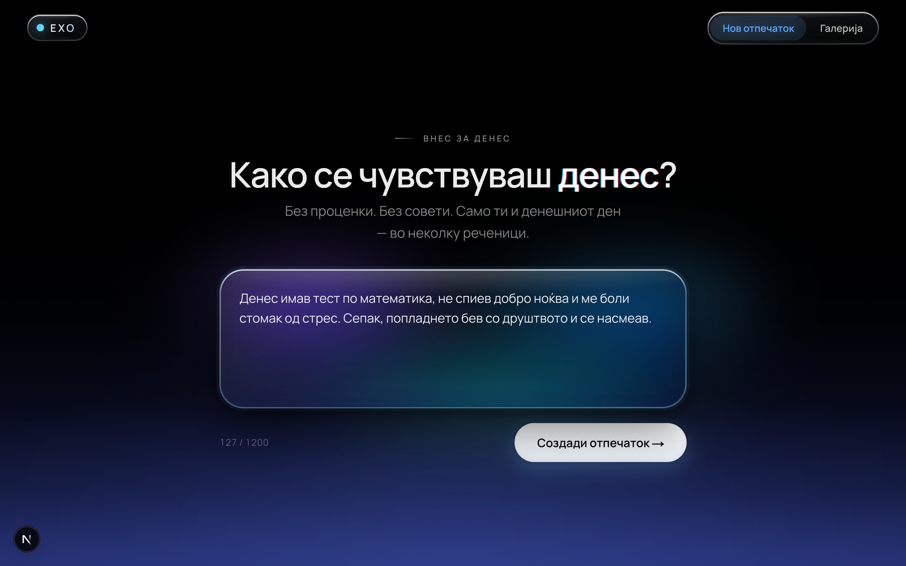
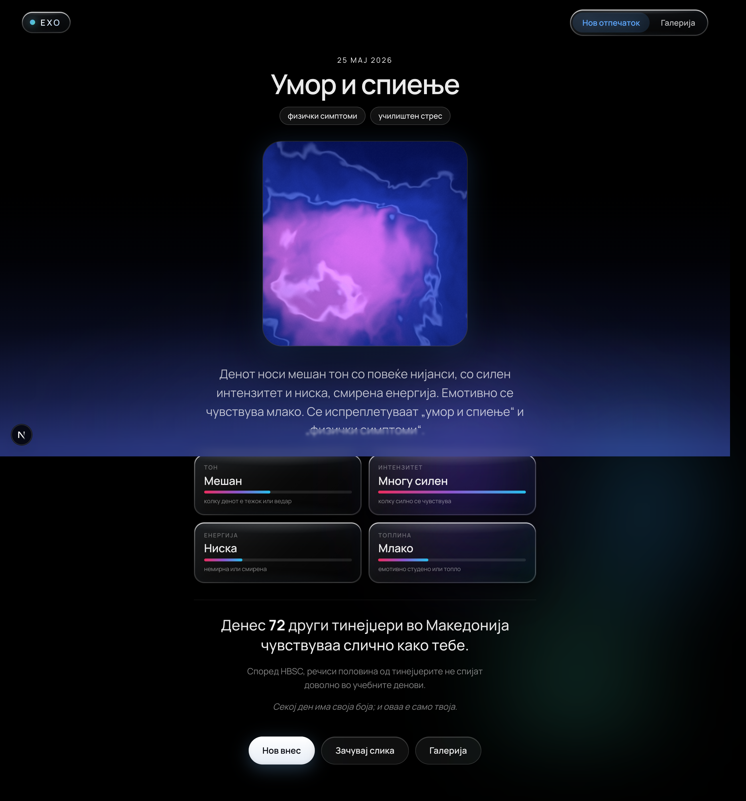
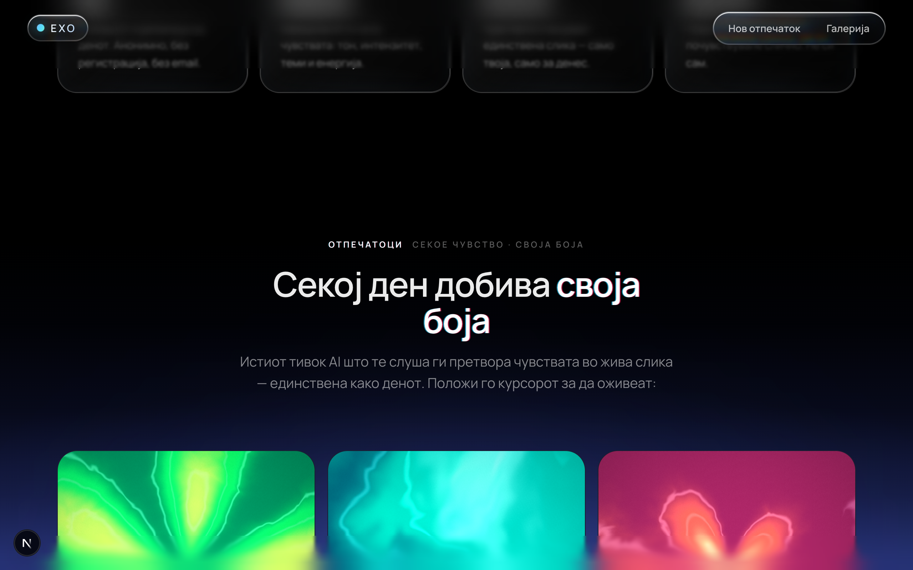
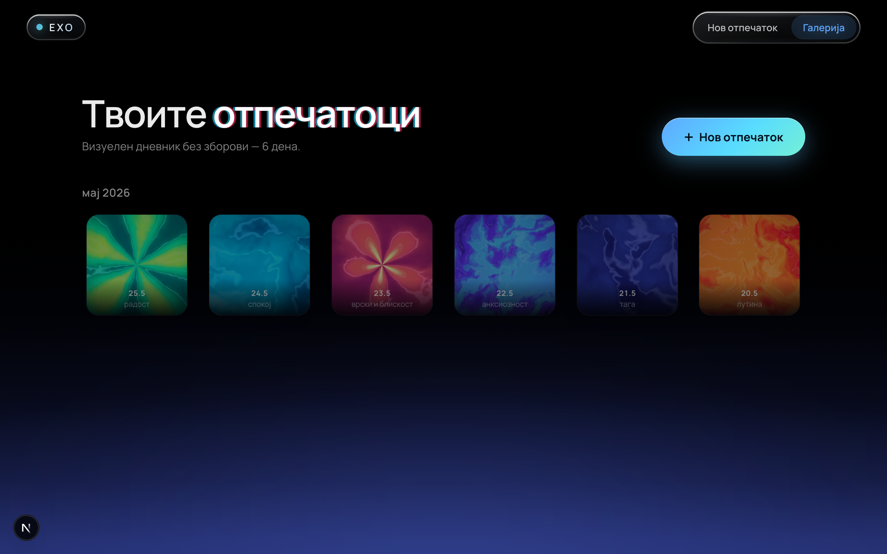
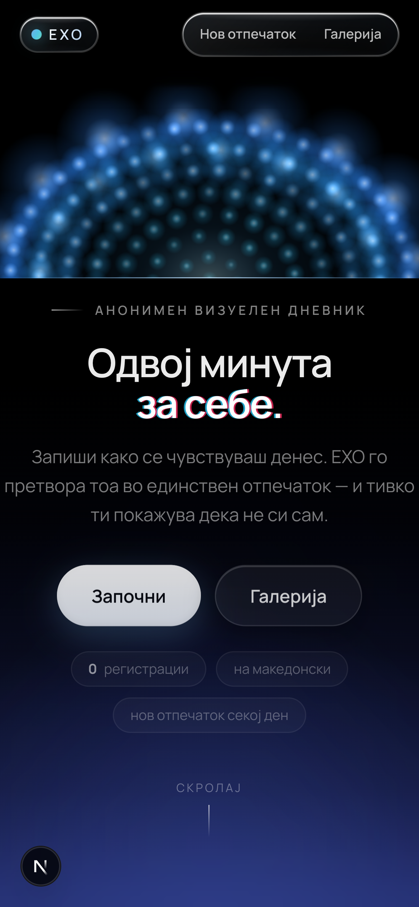
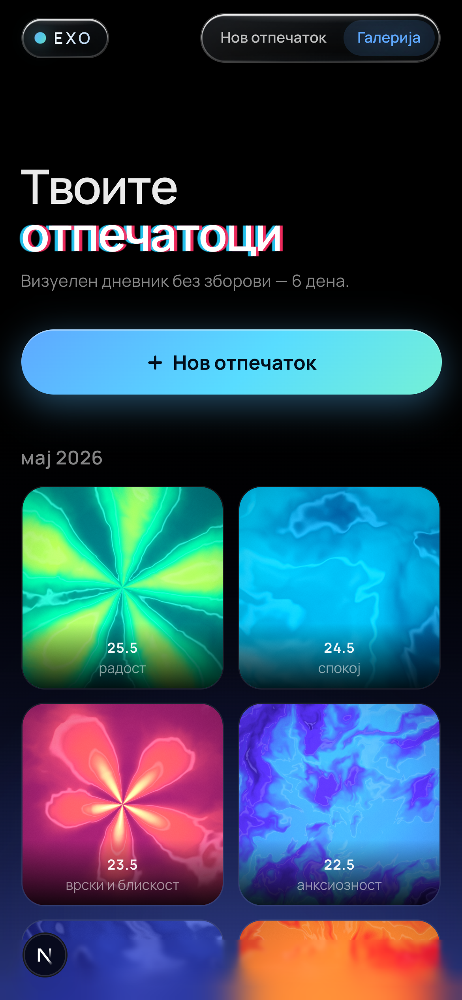

# ЕХО — Емоционална резонанца

### ▶︎ Демо во живо: **[echo-pnuv.vercel.app](https://echo-pnuv.vercel.app)**

> Анонимен визуелен дневник за тинејџери во Македонија. Запиши како се чувствуваш денес, добиј единствен **емоционален отпечаток** и почувствувај дека не си сам.

<p align="center">
  
</p>

<p align="center">
  
  
  
  
  
</p>

---

## Што е ЕХО?

ЕХО е мал веб-простор каде што тинејџер може за помалку од една минута да запише **како се чувствува денес** — без регистрација, без email, без проценки.

Тоа што го напиша се претвора во три работи:

1. **Разбирање** — невидлив AI ги чита чувствата (тон, интензитет, енергија, теми).
2. **Отпечаток** — анализата станува единствена генеративна слика (WebGL), уникатна како денот.
3. **Резонанца** — нежно ти покажува колку други тинејџери денес почувствувале слично, потпрено на отворени HBSC податоци.

Целта не е дијагноза или совет, туку **да го видиш чувството однадвор** и да почувствуваш дека не си сам во тоа.

> Студентски проект по предметот **ПНУВ**. Не е замена за професионална помош.

---

## Преглед

**Внес → Отпечаток.** Напиши неколку реченици; чувството станува жива слика со метрики и резонанца.

<table>
  <tr>
    <td width="50%"></td>
    <td width="50%"></td>
  </tr>
</table>

**Секое чувство · своја боја.** Истиот AI ги претвора емоциите во спектар од отпечатоци.

<p align="center">
  
</p>

**Галерија.** Твоите денови добиваат форма и боја — сè се чува локално на твојот уред.

<p align="center">
  
</p>

**На мобилен.**

<table>
  <tr>
    <td width="50%"></td>
    <td width="50%"></td>
  </tr>
</table>

---

## Главни функции

- ✍️ **Анонимен внес** — 2–4 реченици на македонски, без сметка и без email.
- 🧠 **AI емоционална анализа** — sentiment, интензитет, енергија, „температура" и до 3 теми.
- 🎨 **Генеративен WebGL отпечаток** — секое чувство добива своја боја, форма и движење.
- 🪞 **Резонанца** — „Денес *N* други тинејџери чувствуваа слично како тебе", базирано на HBSC.
- 🖼️ **Галерија** — твоите отпечатоци се чуваат локално (само на твојот уред).
- 💾 **Зачувај слика** — преземи го отпечатокот како PNG (1080×1080).
- 🆘 **Безбедносна мрежа** — ако препознае знаци на криза, нежно нуди вистински линии за помош.
- 🌑 **Calm, Apple-Mindfulness естетика** — мирен интерфејс, кинематографски скрол, почитува `prefers-reduced-motion`.
- 🔌 **Работи и без API клуч** — при недостиг на клуч се користи локална хеуристичка анализа на македонски.

---

## Tech stack

| Слој | Технологија |
|------|-------------|
| Framework | [Next.js 15](https://nextjs.org/) (App Router, RSC) |
| UI | [React 19](https://react.dev/) + TypeScript 5.7 |
| Анимации | [`motion`](https://motion.dev/) (Framer Motion v12) |
| Генеративна графика | Сопствени **WebGL** shader-и (без надворешна библиотека) |
| AI анализа | [Google Gemini](https://ai.google.dev/) преку [`@google/genai`](https://www.npmjs.com/package/@google/genai) (`gemini-3.1-flash-lite`) |
| Стилови | Bespoke CSS (`app/globals.css`), без UI-kit |
| Фонт | Manrope (преку `next/font/google`) |
| Складирање | `localStorage` (анонимно, на клиент — нема база) |
| Податоци | HBSC статистика како локален JSON |

---

## Како да се стартува

### Предуслови

- **Node.js 18.18+** (препорачано **20 LTS** или понова)
- **npm** (доаѓа со Node)

### 1. Клонирај и инсталирај

```bash
git clone https://github.com/andrejt03/echo.git
cd echo
npm install
```

### 2. (Препорачано) Постави **свој** Gemini клуч

Апликацијата работи и **без** клуч — тогаш анализата се пресметува локално. Но за попрецизна анализа внеси свој клуч од Gemini:

```bash
cp .env.example .env.local
```

Потоа во `.env.local` внеси го твојот клуч (земи го од [Google AI Studio](https://aistudio.google.com/apikey)):

```env
GEMINI_API_KEY=твојот_клуч_тука
GEMINI_MODEL=gemini-3.1-flash-lite   # името на моделот што ќе го користиш
```

### 3. Стартувај во development

```bash
npm run dev
```

Отвори [http://localhost:3000](http://localhost:3000).

### 4. Production build

```bash
npm run build
npm run start
```

### npm скрипти

| Скрипта | Опис |
|---------|------|
| `npm run dev` | Development сервер со hot-reload |
| `npm run build` | Production build |
| `npm run start` | Стартува изграден production build |
| `npm run lint` | ESLint проверка |

---

## Како работи

```
       Внес (текст)
            │
            ▼
   POST /api/analyze ──► има GEMINI_API_KEY? ──► Gemini анализа
            │                                         │
            │                 нема клуч / грешка ◄─────┘
            ▼                          │
   Анализа { sentiment, intensity,     ▼
   energy, temperature, themes }   локален fallback (хеуристика на МК)
            │
            ▼
   toFingerprintParams()  ──►  WebGL shader  ──►  единствена слика
            │
            ▼
   computeResonance() (HBSC)  ──►  „N тинејџери чувствуваа слично"
            │
            ▼
   Зачувано во localStorage  ──►  Галерија
```

- **Анализа** → `lib/analysis.ts` (Gemini prompt + локален fallback + валидација).
- **Отпечаток** → `lib/fingerprint.ts` (мапира чувство во параметри) + `lib/fingerprintGL.ts` (WebGL рендерер).
- **Резонанца** → `lib/resonance.ts` + `lib/hbsc.ts` (отворени HBSC податоци).
- **Криза** → `lib/crisis.ts` (детекција на клиент + линии за помош).

---

## Рути

| Рута | Опис |
|------|------|
| `/` | Насловна — херо, HBSC приказна, „како функционира", спектар на отпечатоци |
| `/odraz` | Главниот тек: внес → анализа → отпечаток + резонанца |
| `/galerija` | Галерија со зачувани отпечатоци (од овој уред) |
| `POST /api/analyze` | Емоционална анализа на текстот (Gemini или локално) |

---

## Структура на проектот

```
echo/
├── app/
│   ├── layout.tsx            # Root layout, фонт, глобални ефекти
│   ├── page.tsx              # Насловна (Landing)
│   ├── globals.css           # Сите стилови
│   ├── odraz/page.tsx        # Главниот тек (EchoFlow)
│   ├── galerija/page.tsx     # Галерија
│   └── api/analyze/route.ts  # API за анализа
├── components/               # React компоненти (Landing, EchoFlow, Fingerprint, …)
├── lib/
│   ├── analysis.ts           # AI + локална анализа, типови, теми
│   ├── fingerprint.ts        # Чувство → параметри за shader
│   ├── fingerprintGL.ts      # WebGL рендерер на отпечатокот
│   ├── resonance.ts          # Пресметка на резонанца (HBSC)
│   ├── crisis.ts             # Детекција на криза + линии за помош
│   ├── store.ts              # Анонимна сесија + галерија (localStorage)
│   ├── hbsc.ts               # Пристап до HBSC податоците
│   └── gemini/client.ts      # Gemini клиент
├── public/data/hbsc-mk.json  # HBSC статистика (МК)
├── docs/screenshots/         # Слики за README
└── .env.example              # Пример за environment променливи
```

---

## Приватност и безбедност

- **Анонимно** — нема сметки, нема email, нема серверска база.
- **Локално складирање** — внесовите и отпечатоците живеат само во `localStorage` на твојот уред.
- **Без совети/дијагноза** — AI само го опишува чувството, не води разговор.
- **Безбедносна мрежа** — при знаци на криза се прикажуваат реални линии за помош:
  - СОС телефон за деца и млади (Меѓаши): **0800 1 2222**
  - Итни случаи: **112**

---

## Податоци

Резонанцата и приказната на насловната се потпираат на **HBSC** (Health Behaviour in School-aged Children) за Северна Македонија (`public/data/hbsc-mk.json`). Вредностите се илустративни, базирани на јавните HBSC извештаи, и служат како основа во овој студентски проект.

---

## Напомена

ЕХО е **студентски проект** изработен за предметот ПНУВ и **не е замена за професионална помош**. Ако ти е тешко, разговарај со некого на кого му веруваш или јави се на некоја од линиите за помош погоре.
